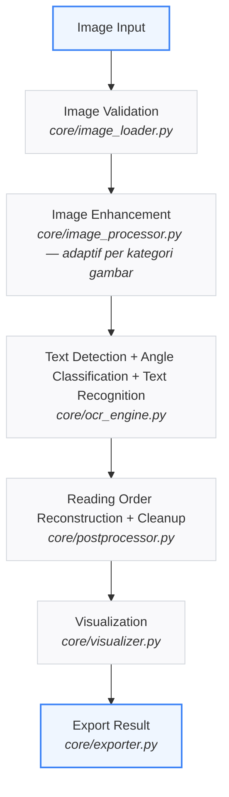

# ai-ocr-system

Sistem OCR (*Optical Character Recognition*) modular berbasis Python, dibangun dari nol dengan **OpenCV** untuk *image enhancement* dan **PaddleOCR** (versi terbaru, arsitektur PaddleX) untuk deteksi, klasifikasi sudut, dan pengenalan teks. Ditargetkan untuk hasil yang mendekati akurasi Google Lens pada berbagai jenis gambar, dalam Bahasa Indonesia maupun Inggris.

> **Catatan Penting:** Sistem ini **tidak menggunakan Tesseract** sama sekali.

---

## Fitur

* **Dukungan Berbagai Media** — Mendukung dokumen, sertifikat, buku, KTP, screenshot WhatsApp/website, poster, banner, papan nama, kemasan produk, brosur, dan teks pada kamera secara real-time.
* **Preprocessing Adaptif** — Sistem otomatis mengklasifikasikan gambar (`document` / `screenshot` / `camera` / `outdoor`) dan hanya menerapkan *enhancement* yang relevan, bukan preprocessing seragam yang berlebihan.
* **Pipeline OCR Lengkap** — Deteksi teks → klasifikasi sudut → pengenalan teks → rekonstruksi urutan baca alami.
* **Akselerasi GPU** — Otomatis memakai GPU jika tersedia, fallback ke CPU jika tidak.
* **Visualisasi Kaya** — Visualisasi *bounding box*, *confidence score*, teks hasil OCR, dan FPS (pada mode realtime).
* **Ekspor Fleksibel** — Menyimpan hasil ke format TXT dan JSON.
* **Logging Lengkap** — Log aktivitas untuk debugging, baik ke console maupun ke file (`logs/ai_ocr_system.log`).
* **Kode Bersih** — Menggunakan type hints, docstring di setiap fungsi, menerapkan prinsip *single responsibility*, tanpa API yang deprecated.

---

## Struktur Folder

```directory
ai-ocr-system/
│
├── app.py                   # Entry point CLI — parsing argumen & orkestrasi pipeline
├── requirements.txt         # Daftar dependency
├── readme.md                # Dokumentasi Proyek
│
├── assets/
│   ├── images/              # Tempat menaruh gambar input (opsional, untuk --folder)
│   └── outputs/             # Gambar hasil anotasi (bounding box) disimpan di sini
│
├── config/
│   └── settings.py          # Konfigurasi terpusat: path, OCR, device, preprocessing profiles, logging
│
├── core/
│   ├── image_loader.py      # Load & validasi gambar/folder/kamera/video
│   ├── image_processor.py   # Preprocessing adaptif berbasis OpenCV
│   ├── ocr_engine.py        # Wrapper PaddleOCR (deteksi + angle cls + recognition)
│   ├── postprocessor.py     # Pembersihan teks & rekonstruksi urutan baca
│   ├── visualizer.py        # Menggambar bounding box, teks, confidence, FPS
│   ├── exporter.py          # Ekspor hasil ke TXT / JSON
│   ├── realtime.py          # Loop OCR real-time untuk kamera/video
│   └── utils.py             # OCRResult, FPSCounter, helper bersama
│
└── outputs/                 # Hasil ekspor TXT/JSON disimpan di sini
```

---

## Teknologi yang Digunakan

| Komponen | Teknologi | Keterangan |
| :--- | :--- | :--- |
| **Bahasa Utama** |  | Python 3 |
| **Image Processing** |  | OpenCV |
| **OCR Engine** |  | PaddleOCR (versi terbaru, arsitektur PaddleX-based) |
| **Numerik** |  | NumPy |
| **Image I/O** |  | Pillow |
| **Deep Learning Backend** |  | PaddlePaddle (CPU/GPU) |

---

## Instalasi

1. **Clone / salin folder project ini**, lalu masuk ke direktorinya:
   ```bash
   cd ai-ocr-system
   ```

2. **(Disarankan) buat virtual environment:**
   ```bash
   python3 -m venv venv
   source venv/bin/activate      # Linux/Mac
   venv\Scripts\activate         # Windows
   ```

3. **Install PaddlePaddle** sesuai hardware kamu (pilih salah satu):
   * **CPU only:**
     ```bash
     pip install paddlepaddle
     ```
   * **GPU (NVIDIA, sesuaikan versi CUDA di panduan resmi PaddlePaddle):**
     ```bash
     pip install paddlepaddle-gpu
     ```

4. **Install dependency lainnya:**
   ```bash
   pip install -r requirements.txt
   ```

> **Info:** Saat pertama kali dijalankan, PaddleOCR akan otomatis mengunduh model (deteksi, klasifikasi sudut, recognition) dari server resminya. Pastikan ada koneksi internet pada run pertama.

---

## Cara Menjalankan

### **OCR pada satu gambar:**
```bash
python app.py --image image.jpg
```

### **OCR batch pada seluruh gambar dalam folder:**
```bash
python app.py --folder assets/images
```

### **OCR real-time dari kamera:**
```bash
python app.py --camera
```
> **Catatan:** Tekan `q` untuk keluar, `s` untuk menyimpan snapshot hasil OCR saat ini.

### **OCR pada file video (frame-by-frame):**
```bash
python app.py --video video.mp4
```

### **Pilih format ekspor** (default: `both`):
```bash
python app.py --image image.jpg --export json
python app.py --image image.jpg --export txt
python app.py --image image.jpg --export both
```

---

## Output yang Dihasilkan

* Gambar teranotasi (bounding box + teks + confidence) → `assets/outputs/<nama_file>_annotated.jpg`
* Hasil ekspor teks → `outputs/<nama_file>.txt`
* Hasil ekspor JSON, dengan skema:
  ```json
  {
    "text": "...",
    "confidence": 0.98,
    "bounding_box": [[x1, y1], [x2, y2], [x3, y3], [x4, y4]],
    "page": 1
  }
  ```

---

## Contoh Hasil

Setelah menjalankan `python app.py --image contoh.jpg --export both`, kamu akan mendapatkan:

1. **`assets/outputs/contoh_annotated.jpg`** — Gambar asli dengan kotak hijau di setiap teks terdeteksi, plus label teks & confidence score di atasnya.
2. **`outputs/contoh.txt`** — Isi teks hasil OCR, satu baris per baris teks, sesuai urutan baca alami (atas ke bawah, kiri ke kanan).
3. **`outputs/contoh.json`** — Daftar record terstruktur per baris teks, siap diproses lebih lanjut oleh sistem lain.

---

## Catatan Arsitektur

Pipeline mengikuti alur berikut, dengan setiap tahap sebagai modul terpisah di `core/` (*Single Responsibility Principle*):



Untuk mode `--camera` dan `--video`, alur yang sama dijalankan berulang per frame oleh `core/realtime.py`, dengan sampling (OCR tidak dijalankan di setiap frame) agar FPS tetap wajar.

---

# Paddle-OCR