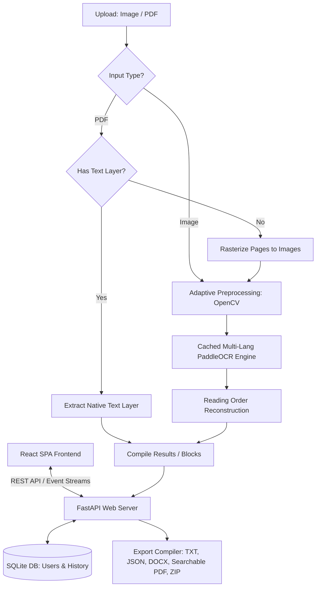

# AI-Powered Full-Stack OCR System

A high-performance, modular, and enterprise-grade Optical Character Recognition (OCR) web application. The backend is built on **FastAPI** with **OpenCV** (adaptive image preprocessing) and **PaddleOCR** (latest model architectures). The frontend is a modern **React + TypeScript + Vite** single-page application (SPA) designed with a clean and professional Neomorphic user interface.

This system operates entirely **without Tesseract** and is engineered to deliver highly accurate reading order reconstruction, smart entity extraction, and multi-language support.

---

## System Architecture

The following diagram illustrates the general workflow of the system, supporting both image and document inputs through a unified processing pipeline:



---

## Core Capabilities

### Unified OCR Workspace
* **Image Processing Panel**: Drag and drop images to visualize OCR bounding boxes instantly. Hover or click regions to synchronize selections, copy specific lines, or view extracted metadata.
* **Smart Entity Extraction**: Automatically extracts currency, phone numbers, email addresses, and web links using regex patterns and OCR confidence bounds.
* **PDF Processing Pipeline**: Automatically analyzes documents page-by-page. It utilizes PyMuPDF to parse native text layers for instant extraction and falls back to 150 DPI page rendering and PaddleOCR if the page is scanned. Progress is streamed in real-time using Line-delimited JSON (NDJSON).
* **PDF Page Previewer**: An interactive page preview list with desktop and mobile-optimized pinch-to-zoom and drag-to-pan overlays.

### Interactive OCR Editor
* **Line-by-Line Content Editor**: Directly modify recognized lines of text. Edits are immediately synced back to the system's coordinates.
* **Undo & Redo System**: Full local history stack to undo and redo manual text changes.
* **Find & Replace**: Search and replace text with case-sensitive filtering and mass replacement options.
* **Auto-Save Debounce**: Real-time save indicators with a 2-second debounce to ensure text edits are preserved locally.
* **Bidirectional Highlight Sync**: Clicking lines in the editor highlights and scrolls to the bounding boxes in the visual preview, and vice versa.

### Multi-Language OCR Support
* **Automatic Language Detection**: Uses `langdetect` to classify the input text and automatically load the closest matched language model.
* **Cached Multi-Language Engine**: Stores loaded PaddleOCR models in a cached server-side dictionary (`self._pipelines`) to prevent delays (3–5 seconds) when switching languages between documents.
* **Supported Languages**: Auto Detect, Indonesian, English, Japanese, Chinese, Korean, and Arabic.

### Advanced Multi-Format Exporting
* **Searchable PDF**: Injects an invisible text layer on top of scanned PDF pages at 72 DPI (standard PDF points), creating searchable and selectable documents without modifying the original page design.
* **Microsoft Word (.docx)**: Exports text structure into native Word document paragraphs via `python-docx`.
* **JSON Output**: Fully structured results containing raw text, box coordinates, confidence scores, and entities.
* **ZIP Archives**: Packages all exported formats (TXT, JSON, DOCX, Searchable PDF) into a single ZIP file created in-memory for download.

### Secure User Authentication & History
* **User Accounts**: Built-in account registration and login endpoints utilizing secure SHA-256 password hashing.
* **Search History Drawer**: Saves all processed documents (images and PDFs) to a SQLite database (`ocr_system.db`). Users can reload previous OCR runs from the drawer instantly without re-processing.

---

## Directory Layout

```directory
paddle-ocr/
│
├── server.py                # FastAPI REST API (Endpoints, Auth, History, SQLite schemas)
├── app.py                   # Legacy CLI entrypoint
├── requirements.txt         # Python dependencies
├── ocr_system.db            # SQLite database file
│
├── config/
│   └── settings.py          # Centralized settings (upload limits, file paths, log settings)
│
├── core/
│   ├── ocr_engine.py        # Multi-language Cached PaddleOCR Engine wrapper
│   ├── pdf_processor.py     # PyMuPDF processing pipeline & searchable PDF generator
│   ├── lang_detector.py     # Text-sample automatic language classifier
│   ├── image_processor.py   # OpenCV-based adaptive image preprocessing
│   ├── image_loader.py      # Input loading and format verification
│   ├── exporter.py          # Word (DOCX) and ZIP compiler
│   ├── postprocessor.py     # Reading-order spatial sorting
│   ├── visualizer.py        # Bounding box drawing overlays
│   └── utils.py             # Shared types & FPS counters
│
├── frontend/                # Vite React + TypeScript Single Page Application
│   ├── src/
│   │   ├── components/      # UI components (OcrEditor, ConfirmationDialog, HistoryDrawer)
│   │   ├── services/
│   │   │   └── api.ts       # API fetch wrapper & blob exporters
│   │   ├── App.tsx          # Router and app workspace controller
│   │   └── main.tsx         # App bootstrapping
│   ├── package.json
│   └── vite.config.ts
```

---

## Installation & Setup

### Prerequisites
* Python 3.8+
* Node.js 16+

### 1. Clone & Set Up Python Environment
1. Enter the repository root directory:
   ```bash
   cd paddle-ocr
   ```
2. Create and activate a Python virtual environment:
   ```bash
   python -m venv venv
   # On macOS/Linux:
   source venv/bin/activate
   # On Windows:
   venv\Scripts\activate
   ```

### 2. Install Dependencies
1. Install PaddlePaddle matching your hardware configuration:
   * **CPU only**:
     ```bash
     pip install paddlepaddle
     ```
   * **GPU (NVIDIA CUDA)**: Refer to the official [PaddlePaddle Installation Guide](https://www.paddlepaddle.org.cn/install/quick?docurl=/documentation/docs/en/install/pip/windows-pip_en.html) to select the correct cuda packages.
2. Install remaining requirements:
     ```bash
     pip install -r requirements.txt
     ```

### 3. Build Frontend Assets
1. Navigate to the frontend directory:
   ```bash
   cd frontend
   ```
2. Install package dependencies:
   ```bash
   npm install
   ```

---

## Running the Application

### Running in Development

1. **Start FastAPI Backend**:
   Activate virtual environment and launch FastAPI:
   ```bash
   # From project root
   python server.py
   ```
   The backend server runs on `http://127.0.0.1:8000`.

2. **Start Frontend Dev Server**:
   ```bash
   # From frontend directory
   npm run dev
   ```
   Open `http://localhost:5173` in your browser.

### Running in Production (Static Build)

To host the application directly from the FastAPI server:
1. Build the production assets in the frontend directory:
   ```bash
   npm run build
   ```
   This compiles static assets into `frontend/dist`.
2. Start the python server:
   ```bash
   python server.py
   ```
   The FastAPI server will serve the full-stack application directly on `http://127.0.0.1:8000`.

---

## API Reference

### Authentication Endpoints
* **`POST /api/auth/register`**: Registers a new user account.
* **`POST /api/auth/login`**: Authenticates user and returns a JWT Bearer token.
* **`GET /api/auth/me`**: Returns the current authenticated user's profile.

### OCR & Processing Endpoints
* **`POST /api/ocr`**: Extracts text from image files. Accepts `file` and optional query parameter `lang` (default `id`).
* **`POST /api/ocr-pdf`**: Streams real-time processing chunks for PDF documents using NDJSON.
* **`POST /api/ocr/export`**: Receives coordinates text arrays and formats dynamic exports (TXT, JSON, DOCX, Searchable PDF, or ZIP).

### History Log Endpoints
* **`GET /api/history`**: Retrieves all database logs associated with the active user.
* **`DELETE /api/history/{id}`**: Permanently deletes an entry from the history log.