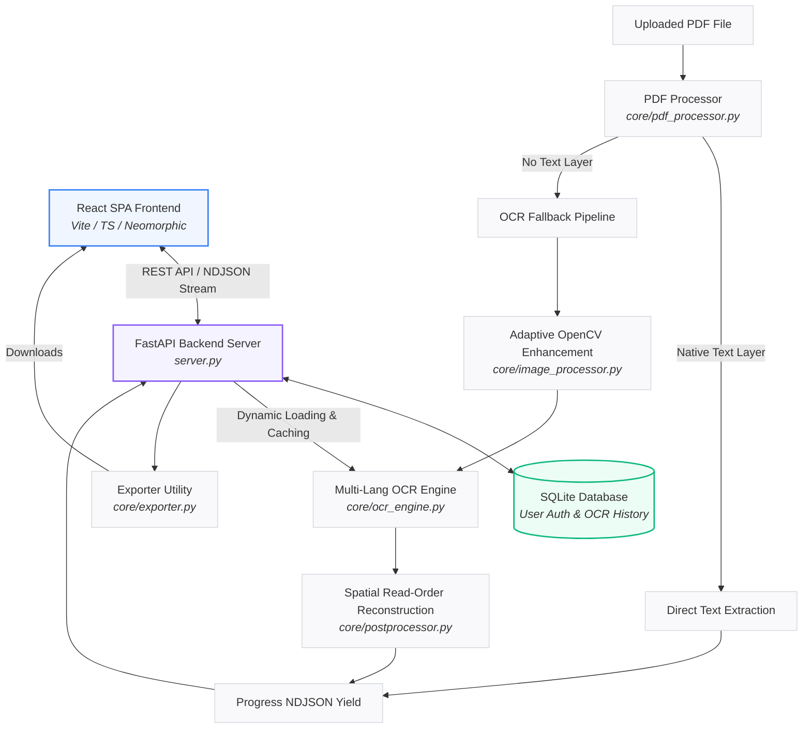

# AI-Powered Full-Stack OCR System

A high-performance, modular, and premium full-stack Optical Character Recognition (OCR) web application. The backend is powered by **FastAPI**, **OpenCV** (adaptive image preprocessing), and **PaddleOCR** (latest version with PaddleX architecture). The frontend is a modern **React + TypeScript + Vite** single-page application (SPA) styled with **Neomorphic UI principles**.

This system operates **without Tesseract** and is designed to provide Google Lens-like reading order accuracy, entity extraction, and multi-language support.

---

## Architecture Workflow



---

## Key Features

### 🌟 Premium Web Workspace
* **Image OCR Workspace**: Drop files to view live visual bounding boxes, hover or click to sync highlights, and copy single lines or extract smart entities (currency, phone numbers, emails, web links).
* **PDF OCR Pipeline**: High-speed, page-by-page processing of multi-page documents. 
  * Checks if pages contain a native text layer to extract text directly (instant results).
  * Automatically falls back to high-resolution image rendering (150 DPI) + PaddleOCR if the page is scanned.
  * Streams real-time progress updates via Line-delimited JSON (NDJSON).
* **PDF Page Zoom Viewer**: Click page thumbnails to view page previews in fullscreen. Supports touchscreen pinch-to-zoom and drag-to-pan navigation on mobile.

### 📝 Interactive OCR Editor
* **Rich Line-by-Line Editor**: Edit every single word or line recognized by the system.
* **Undo & Redo History**: Complete state stack to roll back or re-apply modifications.
* **Find & Replace**: Search using case-sensitivity filters and perform single or batch replacements ("Replace All").
* **Auto-Save Indicators**: Dynamic neomorphic status display showing active saving (using a 2-second debounce).
* **Dual-Direction Highlight Synchronization**:
  * Click on text inside the editor $\rightarrow$ Highlights the corresponding bounding box coordinates in the visual preview.
  * Click on any bounding box in the preview $\rightarrow$ Highlights and scrolls to the corresponding line inside the editor panel.

### 🌐 Multi-Language Support
* **Auto-Language Detection**: Uses `langdetect` to examine document text samples and match the most appropriate model dynamically.
* **PaddleOCR Model Caching**: Prevents model reload delays (3–5s) by keeping multi-language models loaded in a cached pipeline dictionary (`self._pipelines`) on the server.
* **Languages Supported**: Auto Detect, Indonesian, English, Japanese, Chinese, Korean, and Arabic.

### 📂 Advanced Multi-Format Exporting
* **Searchable PDF**: Injects an invisible text layer on top of scanned PDF pages at standard 72 DPI resolution, matching the visual layout perfectly.
* **Microsoft Word (.docx)**: Compiles formatted paragraphs and reading order alignments natively via `python-docx`.
* **JSON Output**: Fully structured results containing raw text, confidence coordinates, and detected entities.
* **ZIP Archive**: Generates and compresses all formats (TXT, JSON, DOCX, Searchable PDF) into a single archive in memory on the fly.
* **Consistent Syncing**: Exported files are generated dynamically based on active edits in the editor.

### 🔒 User Accounts & History Drawer
* **Authentication**: Password registration and secure authentication using SHA-256 password hashing.
* **OCR History Log**: Saves processed file metadata and coordinates to a SQLite database (`ocr_system.db`) under `is_pdf: true/false`. Reload files instantly from the history drawer without running OCR again.

---

## Directory Layout

```directory
paddle-ocr/
│
├── server.py                # FastAPI server (Endpoints, Auth, History, SQLite schemas)
├── app.py                   # Legacy CLI entrypoint
├── requirements.txt         # Python dependencies
├── ocr_system.db            # SQLite database file
│
├── config/
│   └── settings.py          # Centralized configuration (sizes, directories, log schemas)
│
├── core/
│   ├── ocr_engine.py        # Multi-language Cached PaddleOCR Engine wrapper
│   ├── pdf_processor.py     # PyMuPDF pipelines, NDJSON generator, & searchable PDF compiler
│   ├── lang_detector.py     # langdetect language classification wrapper
│   ├── image_processor.py   # OpenCV-based adaptive preprocessing enhancement
│   ├── image_loader.py      # Input loaders and validation
│   ├── exporter.py          # Word (DOCX) and ZIP compilation
│   ├── postprocessor.py     # Natural read-order reconstruction
│   ├── visualizer.py        # Bounding box drawing overlays
│   └── utils.py             # Shared types & FPS calculators
│
├── frontend/                # Vite React + TypeScript Single Page Application
│   ├── src/
│   │   ├── components/      # Neomorphic UI elements (OcrEditor, ConfirmationDialog, PDFPageZoomViewer, HistoryDrawer)
│   │   ├── services/
│   │   │   └── api.ts       # Fetch API client and blob exporters
│   │   ├── App.tsx          # Main application workspace routing
│   │   └── main.tsx         # Bootstrapper
│   ├── package.json
│   └── vite.config.ts
```

---

## Installation & Setup

### Prerequisites
* Python 3.8+
* Node.js 16+

### 1. Clone & Setup Python Environment
1. Enter the repository root directory:
   ```bash
   cd paddle-ocr
   ```
2. Create and activate a Python virtual environment:
   ```bash
   python -m venv venv
   # On macOS/Linux:
   source venv/bin/activate
   # On Windows:
   venv\Scripts\activate
   ```

### 2. Install Python Dependencies
1. Install PaddlePaddle (depending on your hardware):
   * **CPU only**:
     ```bash
     pip install paddlepaddle
     ```
   * **GPU (NVIDIA CUDA)**: Refer to the official [PaddlePaddle Installation Guide](https://www.paddlepaddle.org.cn/install/quick?docurl=/documentation/docs/en/install/pip/windows-pip_en.html) to choose the correct cuda packages.
2. Install remaining requirements:
     ```bash
     pip install -r requirements.txt
     ```

### 3. Setup Frontend
1. Navigate to the frontend directory:
   ```bash
   cd frontend
   ```
2. Install package dependencies:
   ```bash
   npm install
   ```

---

## Running the Application

### Running in Development

1. **Start FastAPI Backend**:
   Activate virtual environment and launch FastAPI:
   ```bash
   # From project root
   python server.py
   ```
   The backend server will run on `http://127.0.0.1:8000`.

2. **Start Frontend Dev Server**:
   ```bash
   # From frontend directory
   npm run dev
   ```
   Open `http://localhost:5173` in your browser.

### Running in Production (Static Build)

To host the application directly from the FastAPI server:
1. Build the production assets in the frontend directory:
   ```bash
   npm run build
   ```
   This compiles static assets into `frontend/dist`.
2. Start the python server:
   ```bash
   python server.py
   ```
   The backend FastAPI server will automatically mount `frontend/dist` and serve the entire full-stack app directly from `http://127.0.0.1:8000`.

---

## API Documentation

### Authentication Endpoints
* **`POST /api/auth/register`**: Registers a new user. Accepts JSON body containing `email` and `password`.
* **`POST /api/auth/login`**: Authenticates user credentials and returns a JWT Bearer token.
* **`GET /api/auth/me`**: Returns the active authenticated user profile details.

### OCR & PDF Processing Endpoints
* **`POST /api/ocr`**: Analyzes single image inputs. Optional query parameter `lang` (default `id`).
* **`POST /api/ocr-pdf`**: Standard NDJSON streaming endpoint for processing documents. Receives `file`, query parameters `lang`, and streams line-delimited progress metrics.
* **`POST /api/ocr/export`**: Receives coordinates text arrays and formats dynamic exports (TXT, JSON, DOCX, Searchable PDF, or ZIP).

### History Log Endpoints
* **`GET /api/history`**: Retrieves all database logs associated with the active user.
* **`DELETE /api/history/{id}`**: Permanently deletes a specific entry from the history log.